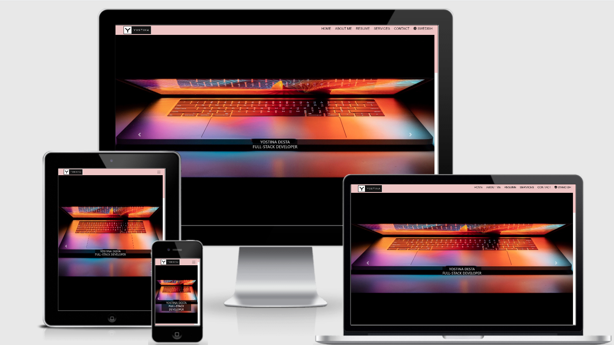

# # My Portfolio

A live demo can be found [here](https://yostina-dh.github.io/My-Portfolio/.)

## Introduction

My Portfolio is a responsive design Website.

I designed the Website to make information about myself and to view easily accessible, to allow people to see my works and offers, even to collaborate with individuals and various companies around the globe. The portfolios present:
* Personal Information
* Working History
* Educational Background 
* Services
* Offers
* Contact Information
* Language alternative

The primary purpose of the website is to show the services and offers, even to make myself a brand. That is why it already has all the features of my existing services. Any companies HR-Recruiter or individual users can easily find the Contact button both in the menu bar and at the bottom of the page.

It is a one-stop-shop for me to show my branding and build a profile on my skills and attributes.

It also takes into account both international users and local users. So it has both English and Swedish versions.

The site is responsive and can be easily navigate in any type of device.

## Table of Content

1. [UX](#ux)
    * [Goals](#goals)  
    *   [My Portfolio](#My-Portfolio)
        * [Business goals](#business-goals)
        * [Customer goals](#customer-goals)
    * [User Stories](#user-stories)
        * [A Developer](#A-Developer)
        * [Company and Business owner](#Companyand-Business-owner)
         * [The UX designer](#the-ux-designer)
    * [Design](#design)
        * [Colors](#colors)
    * [Wireframes](#wireframes)
2. [Features](#features)
    * [Existing Features](#existing-features)
        * [Elements present on every page](#elements-present-on-every-page)
        * [Other elements](#other-elements)
    * [Features left to implement](#features-left-to-implement)
3. [Technologies Used](#technologies-used)
4. [Testing](#testing)
5. [Bugs](#Bugs and Fixes for Future Releases After Testing)
5. [Compatibility & Responsiveness ](#Compatibility-Responsiveness)  
7. [Deployment](#deployment)
    * [Hosting on GitHub Pages](#hosting-on-github-pages)
    * [How to run this project locally](#how-to-run-this-project-locally)
8. [Credits](#credits)
    * [Media](#media)
    * [Acknowledgements](#acknowledgements)
        * [Examples and Tutorials and Samples](#examples-and-tutorials-and-samples)
        * [Pages used for information](#pages-used-for-information)
        * [I received advice and encouragement from](#i-received-advice-and-encouragement-from)
9. [Disclaimer](#disclaimer)

## UX

### Goals

#### My Portfolio

The goal of the site is to show services and offers, even make myself a brand and, in turn, attract companies and anyone who wants to collaborate.

**Target users is:**

* Anyone who needs a developer.
* All small business owners who wish to update a website or work together.
* All start-ups who want a website or digital marketing.
* Any companies who want a freelance developer.

#### Business goals

* To create a network
* Have a fully proficient web page.
* Fully functional website.
* Have an intuitive design.

#### Customer goals

* Make functional networks in the technology sector either outside the industry.
* Find a Developer  who has experience in the services required.
* Find previous works made by other Developers.
* Find a Developer meetup club or groups.

Both business and customer goals are addressed through user stories.

### User Stories
#### A Developer

* As a Developer, I want to show my work and my educational background so that companies can easily see if I can fill in the company's gaps or for some cooperation.
* As a Developer, I want my page to load quickly so that the user can easily get involved.
* As a Developer, I want to show positive reviews so that I convince companies to hire me or to work together.
* As a Developer, I want any users to have an easy way to find my contact details so that they can see my offer services.
* As a Developer, I want my services for locals users and international users that can be attractive for all kinds of companies and even for individuals.
* As a Developer, I want to do quality work and give an affordable price for my services so that I can make them happy, and I can build a useful and broad network. 

#### company And Business owner

* As a company ,I want more information about the person and want to see if he/she is capable enough for hiring or collaboration.
* As a company, I want to see a person's skills and how many programming languages ​​he/she knows so that I can determine if the quality of work meets my requirements and standards.
* As a company, I want to know the person's educational background and experience so that I can quickly negotiating for a salary.
* As a Business owner, I want to know how I contact the person to ask project request.
* As a Business owner, I want to know the services and offers before requesting for collaboration or a single project request so it can help me compare with another Developers.
* As a Business owner, I want to see examples of best-offered Services so that I can determine if the quality of work meets my requirements and standards.

#### The UX designer

* As a UX designer, I want to track the user behaviour so that I can improve the user experience.
  * As a UX designer, I want to track the user behaviour so that I can identify any possible user confusion over navigating the website.
  
### Design
* [Users Logo ](assets/images/logo.jpg)
* Users Logo - Black and white the first alphabet of my name and its representing me.

#### Colors

Following colors have been used:
* #eec5c5(Light grayish red)
* #f57a4d(Soft orange)
* #6e6464(Very dark grayish red)
* #f5f5f5 (Very light gray) (mostly white)
* #0000(black)
* #8d8585 (Soft red)
* #5975e6(Soft blue)
* #007bb5(Strong blue)
* #d66363(Very dark desaturated red)
* (Moderate red)
  
The stand out colour for this web page is Light grayish red and white. The reason I choose this color is that I'm just a color-loving person, and I want to reflect on my websites, one of my favorite color.

#### Font

The Fonts I used for this project are **Josefin Sans**  with the font weights: 
* 14px- for most of the subtext.
* 16px/bold - for headers and titles.   

The [Josefin Sans](https://fonts.google.com/specimen/Josefin+Sans) the font was chosen for its looking good on all types of devices.

### Wireframes

I decided that it would be more helpful to have mockups than simple wireframes. The mockups were done in [balsamiq](https://balsamiq.com/). 

Pictures from Balsamiq:
[Link](assets/Wireframes/Milestone-Project-one.pdf)

## Features
### Existing Features

#### Elements seen on every page

* **Layout and Style**
    * Before jumping into my project I researched different layout and structure for a single portfolio website, and I noticed that most portfolio pages were very loaded, more animated and used too many languages, so I decided that mine would be classic and simple according to my short term code experience.

* **Navigation bar**
    * Has a `fixed` position to ensure that the user can access it at any time.
    * My Portfolio and brand name in the left corner which also serves as a link to go back to the landing page. (assets/images/logo.jpg)

* **Footer**
    * Copyright information.

* **Images**
    * one of the images has a light gray red floating effect

#### Other elements

* **Landing page**
    * Has images and text. A text represents the images, and it can change the color when `hover` or clicked on. 

* **About Me page**
    * Has a box-text with`hover` and an image showing a piece of information.

* **Resume page**
    * Has two columns loaded with work experience and educational background.
    
* **Service pages**
    * Has four boxes filled by available services and used a beautiful hover effect used.

* **Contact  page**
    * Has a form which asks for contact information and a message. The form boxes have Light grayish red borders and light blue shadow.
    * Social media links - facebook, Twitter, Instagram and Github.
    * Phone Number (linked to click-to-call function for small devices).
    * Email Address (linked to mailto function).
    * Printable version of my CV can download it in a new tab.

### Features left to implement

* Add new features for accessibility for all types of users—for example, a text reader for those who are not able to read the text by themselves.
* Add other sections, such as a project section and blog section.
* Add a view comment box in the contact section and GPS location.
* Add 3D Animation.

## Technologies Used

### Languages

* HTML - Base language for this project.
* CSS - used for styling the HTML code.
* JQuery - used in conjunction with Bootstrap.

### Libraries

* [Bootstrap](https://getbootstrap.com/) - used for responsive grid system, navigation and carousel.
* [JQuery](https://jquery.com/) & [Popper](https://popper.js.org/) - were used in conjunction with the Bootstrap library.
* [FontAwseome](https://fontawesome.com/) - used for all icons on the site.
* [Google Fonts](https://fonts.google.com/) - used for the Josefin Sans.
* [Hover.css](https://ianlunn.github.io/Hover/) - used to animate the naviagtion links, services icons and social media icons.

### Tools
* [Visual Studio](https://code.visualstudio.com/) - used for my local machine and use as my first  IDE for this project.
* [Gitpod](https://www.gitpod.io) - used as a second IDE for this project.
* [Git](https://git-scm.com/) - used for version control.
* [Github](https://github.com/) - used to host repository and live website.
* [Balsamiq](https://balsamiq.com/) - used for creation of mockups.
* [Am I Responsive](http://ami.responsivedesign.is/) - used for testing purposes as well as creating the image to display the web pages on different devices.
* [Google Chrome DevTools](https://developers.google.com/web/tools/chrome-devtools) - used for testing and debugging.
* [PageSpeed insights](https://developers.google.com/speed/pagespeed/insights/) - used for testing the loading speed of the site.
* [W3 html validator](https://validator.w3.org/) - used to test and validate my html code.
* [W3 css validator](https://jigsaw.w3.org/) - used to test and validate my css code.
* [Browserstack](https://www.browserstack.com/) - used to test my site on different browsers.
* [Color Scheme Designer](http://colorschemedesigner.com/) - used to test colour combinations.

## Testing
This site was thouroughly tested manually and automated.

The W3 Css Validation Service was used for test first development where tests are written first then the fuctionality is written to pass the tests.

### Code Validation

   * I used the [W3C Markup Validation Service](https://validator.w3.org/) to validate my html code.
   * I used the [W3C CSS Validation Service](https://jigsaw.w3.org/) to validate my css code.
   * I used the [Free Formatter](https://www.freeformatter.com/) website to format my html code.

 * The code validators highlighted 4 errors and Warning too.
      * Using incorrect syntax for the resume section and  - this issue has been fixed for the first release.
      * Missing a to close a section tag inside a resume section  - this issue has been fixed for the first release. 
   * The carousel issue on the desktop, the images become very wide and do not look natural like dosing it on the smaller devices- to look at in future editions.
   * Document uses the Unicode Private Use Area(s), which should not be used in publicly exchanged documents-this issue has been fixed for the first release. 
 
## User testing

### My Mentor

* She helped me from the beginning  of the project to the end. For instance,
    * To change the burger menu  size and color.
    * Fix the size of the carousel and to make it full size.
    * Create quale distance between all sections border radius begins (seat), so that the border and content isn't making contact 
    * Reduce the size of the image on the About me image and the box.
    * Fix the size of about section @ media issue for desktop screen sizes - I tried to solve the problem but but is not solved as she recommend - will look at in future releases.

### Bugs and Fixes for Future Releases After Testing

* **@media** -  After the last session of this project with my mentor, I realize that I still facing to fix the image and the floating effect box on the about section. I think this can be addressed by writing additional CSS for future releases.
* **Colour Contrasts** - The colours used on the site are too similar and could cause an issue for accessability. These issues will be addressed in the next release.
* **Social Media Links in Footer** - The social media icons are linked to the correct pages, however these are currently generic login pages. These will direct you to the company specific pages in future releases.
* **Desktop Lanscape View** - On some home page, when viewing on a desktop in Carousel, has a different result. This will be fixed on the next release.
* **Bootstrap Carousel** - Not happy with the size of the pictures. It should have to be looking great in a professional way,  Just add a certain future that will make it look good. I think this can be handled by writing additional styling and floating for future releases.

## Compatibility & Responsiveness 

* This site was tested across the following browsers to ensure that all functionalities render well in different browsers:
1. Google Chrome
2. Internet Explorer
3. Safari 
4. Mozilla Firefox

I also  tested directly  on the following devices:
1. Galaxy S5
2. Pixel 2 
3. Pixel 2 XL 
4. iPhone 5/SE 
5. iPhone 5/SE 
6. iPhone 6/7/8 
7. iPhone 6/7/8 Plus 
8. iPhone X 
9. iPad 
10. iPad Pro 

## Deployment

This web page was developed in Gitpod and pushed to the remote repository, GitHub. The live page is hosted on GitHub Pages. 

**Used commands during deployment:**
* `git add .` - to add the files to the staging area.
* `git commit -m "text message here"` - to commit the files.
* `git push` - to push to origin master branch on to GitHub.
* `git status` - to see the current status of the files.

### Hosting on GitHub Pages

* Log into GitHub.
* From the list of repositories choose [My-Portfolio](https://github.com/YOSTINA-dh/My-Portfolio).
* Go to settings.
* Scroll down to GitHub Pages section.
* Select as a source **master branch**.
* The page is now automatically refreshed and the project is deployed.
* To access the project scroll down again to GitHub Pages section and click on the provided link.

For more detailed information regarding deployment to GitHub Pages click [here](https://pages.github.com/).

### How to run this project locally

**Clone this project from GitHub:**

* Go to [My-Portfolio](https://github.com/YOSTINA-dh/My-Portfolio) GitHub repository.
* Click on "Clone or download" green button.
* Copy the URL to the repository.
* Open the terminal in your IDE.
* Choose the working directory where you would like to have the cloned repository.
* Type git clone, and add the URL you copied from Github: `git clone https://github.com/YOSTINA-dh/My-Portfolio.git`
* Press Enter and your local clone will be created.

For more information regarding cloning of a repository click [here](https://help.github.com/en/github/creating-cloning-and-archiving-repositories/cloning-a-repository).

## Credits

### Content

All content on the web page was written by me with the exception of the elements of navbar and from Bootstrap Carousel for my home page.

### Media
**Images**
   * Two images were found on [Unsplash] (https://unsplash.com/images)
   * And the other two images taken by Photografer [Anna Schoripix and lan Johnson]

### Acknowledgements

#### Examples and Tutorials and Samples

* [Code Institute](https://github.com/Gmanprodev/Bootstrap) - used the 'Rosie odenkirk' page as the initial code structure for my project. 
* [The freecodecamp/](https://www.freecodecamp.org/) used to resunme page and understand the syntacs for my code.
* [Youtuber](https://www.whatsdev.com/) used to for inspiration and ideas for the wbiste structure. 
* [Youtuber](http://www.cleverprogrammer.com/)used to for inspiration and ideas for the wbiste structure.
* Inspiration resources for writing this README file:
    * [Marc Gulliver](https://github.com/Gmanprodev/Mr-Digbee) (A code institute student)
    
   

#### Pages used for information

* [The freecodecamp/](https://www.freecodecamp.org/)
* [YouTuber](https://www.whatsdev.com/)
* [YouTuber](http://www.cleverprogrammer.com/)
* [W3schools](https://www.w3schools.com/)
* [W3C](https://www.w3.org/)
* [Stack overflow](https://stackoverflow.com/)
* [CSS-Tricks](https://css-tricks.com/)

 ####   Thank you to the following for inspiration, motivation and the direction I needed:
 * Seun Owonikoko (My mentor) (Thankyou For Being The Best Mentor)
 * Code Institute  (https://codeinstitute.net/)
 * Stackoverflow (https://stackoverflow.com/)
 * Nejat Ahmed (My Friend)
 * Leykun Adugna (My Friend)
 
  **(My Family and  Dearest Noel Daniel,thank you for your love, support, motivating me to be a better person, and showing me the potential I don't see it before. It is all about you, Guys.)**

## Disclaimer

**This web page was created for educational purpose only.** 