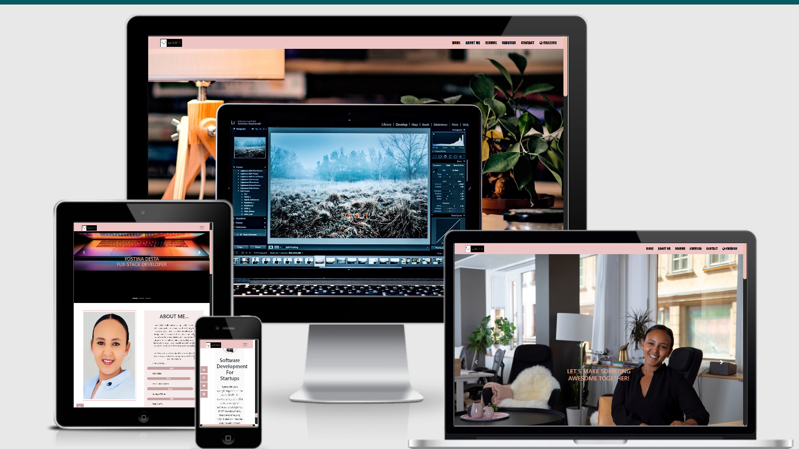

# My protofolio Viewer

This Website built for educational purposes, and I designed the site to 
make information about myself and to view easily accessible, to allow people 
to see my works and offers to collaborate with various companies around the globe.

This portfolio provides information about my services, including about my page, 
contact information, resume, and even takes into consideration both international
users and local users. So it has both English and Swedish versions.

This site developed as a prototype that can be used right after school, just add some future technology. 
That is why it already has all the features of my existing services offered.
It is a one-stop-shop for me to show my branding and build a profile on my skills and attributes.

### Ux

### Users 

The project is intended to show information about myself and my brand. 
The site layout is exquisite and simple. It is responsive and can be easily
navigate across all types of devices. The user lands on the Home page, 
where they can navigate to an about me page, resume, services, and contact information.
This project can replicate by anyone interested in building something similar.

### User Stories
1. A user wants to show the services to anyone who wants to work together and build something special together.
2. A professional education user wants to share learning resources with other developers.
3. As a recruiter user, I want more information about the person and want to see if he/she is capable enough for hiring or collaboration.
4. For any company that recruits users seeking information and services,  
   it must have some specific information to reach the person quickly via social media and direct phone.
5. As users of this site, it must be easy to navigate, and the pages should be appealing on all devices.

 ### Design

- Users Logo - Black and white the first alphabet of the user and name of the user representing Yostina.

## Wireframes

Pictures from Balsamiq:
[Link](assets/Wireframes/Miestone-project-one.pdf)

## Features
Future Planned for the functionality of the interactive features and implemented and described for development.

### Planned Features

## Planned Features
- Focused on user-centric front-end development
- HTML, CSS Framework and Bootstrap
    - Grid System - Columns and Rows
    - Boxs
    - Icons
- Responsive design - Mobile First
- UX elements
    - User Flow
    - Hover
    - Transitions
- Accesibility
- Git - Version Control 
- GitPod-Version Control 
- GitHub - Remote Repository
- Deployed - Hosted on Github Pages
- Documentation - ReadMe File
- Custom Logo

### Existing Features
- Focused on user-centric front-end development
- HTML, CSS Framework and Bootstrap
    - Grid System - Columns and Rows
    - Boxs
    - Icons
- Responsive design - Mobile First
- UX elements
    - User Flow
    - Hover
    - Transitions
- Accesibility
- Git - Version Control 
- GitPod-Version Control 
- GitHub - Remote Repository
- Deployed - Hosted on Github Pages
- Documentation - ReadMe File
- Custom Logo

### Features Left to Implement
   - Add new features for accessibility for all types of users—for example, a text reader for those who are not able to read the text by themselves.
   - Add other sections, such as a project section and blog section.
   - Add a view comment box in the contact section and GPS location.
   - Add 3D Animation.

## Technologies Used

This project makes use of:
- [HTML](https://developer.mozilla.org/en-US/docs/Web/HTML)
    - HTML for strucutre
- [CSS](https://developer.mozilla.org/en-US/docs/Web/CSS)
    - CSS for Styling
- [Bootstrap 4.5.0](https://getbootstrap.com/)
    - HTML and CSS Framework from **Bootstrap**
- [w3school] (https://www.w3schools.com/)
    -**w3school** was used for research and to correct some elements 
- [Google Chrome](https://www.google.com/chrome/)
    - Used for browser and dev tools
- [Google](https://www.google.com/)
    - **Google** was used for research.
- [Visual Studio Code](https://code.visualstudio.com/)
    - This project was built using the **VS Code** IDE for my local machine
- [Git](https://git-scm.com/)
    - **Git** used for Version Control
- [GItpod](https://www.gitpod.io/)
    -This project imported from **VS Code** IDE to **gitpod**
- [GitHub](https://github.com/)
    - Repository hosted on **GitHub**
- [Am I Responsive](http://ami.responsivedesign.is)
    - Testing responsiveness of the website
- [The w3 CSS Validation Service](https://jigsaw.w3.org/css-validator/) 
    - Testing Css code
- [Stackoverflow]( https://stackoverflow.com/) 
    - **Stackoverflow** was used for research and quations. 

